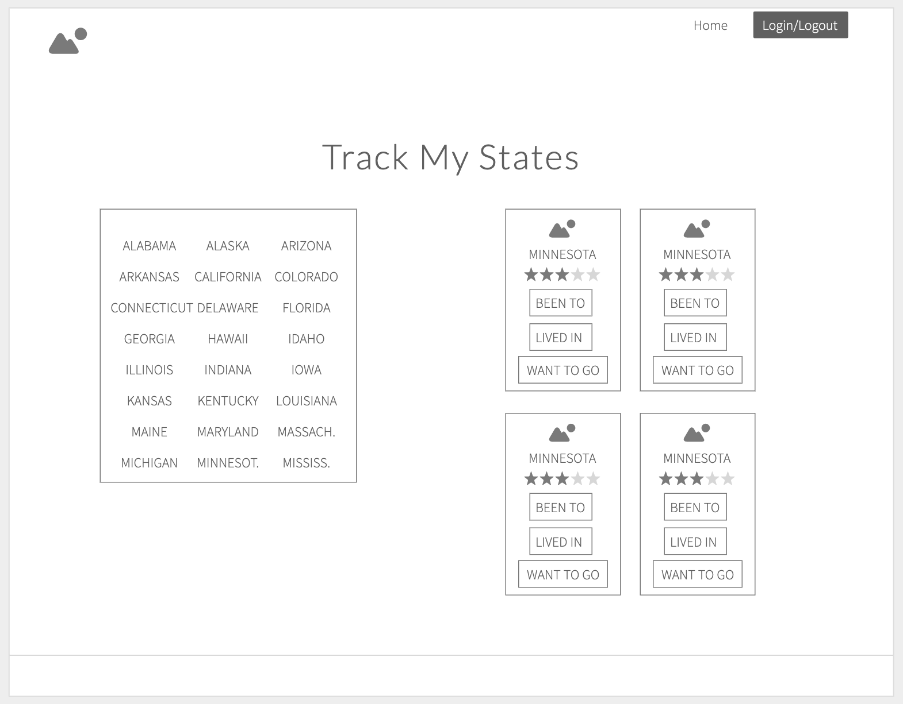

Project Kanban  
[](https://app.zenhub.com/workspaces/track-my-states-5d0d5159d107507c0be3d349/board?repos=188627017)

# Track My States
Track My States is a responsive web application designed to help users keep track of states they've visited, lived in, and want to visit.

## Project Objectives
  * Learn GIS fundamentals through incorporating 3rd party mapping data from Esri's ArcGIS JavaScript API.
  * Integrate previously learned technologies and best practices, including:
  	* Test-driven development
  	* Agile methodologies
  	* React/Redux
  	* REST API construction in Node/Express/Knex and PostgreSQL
  	* User Sign In/Sign Out functionality using Redux and PostgreSQL

## Iterations

### Iteration 0: Create wireframes and plan main functionality

### Iteration 1: Basic elements
  * Add components and containers that display all foundational elements on page with no specific content.

### Iteration 2: Create RESTful API for Users with corresponding States and Visited/Lived-in statuses
  * Create Users database with user login information and references to states visited and lived in.
	* Create States database with unique id for each state.

### Iteration 3: Sign In / Sign Out Functionality
  * Be able to sign in on page `/login` and redirect user to `/`
    * Flash "Email and Password do not match" - if password is incorrect
  * Ability to create a user.
    * Flash "Email has already been used" - if email has been taken
  * The user has the ability to sign out. 

### Iteration 4: Basic display with mock content
  * Upon user sign in, page should display list of all states with option to toggle selection of each upon click.
  * Upon click of state, state should show active status and display card pertaining to that state.
  * Each state should have: 
  	* Image of flag
  	* State name 
  	* 5 stars for rating
  	* Buttons for 'visited', 'lived in', and 'want to go' 
  	* 'Favorites' button
  
### Iteration 5: State card details
  * Each state card should update its rating based on number of stars clicked.
  * Upon clicking any of the 3 main buttons, status should update in database.
  * If the user is not signed in and clicks on a favorite button the user will be prompted with the request to create an account.
  * Validate favorites before adding to db. Aka does that user already have the movie stored as favorites. There should be no duplicates. 
  * If the user visits `/favorites` they should see a list of all their favorite states.
  * The user should be able to delete favorites from `/favorites` or `/`.
  * Favorite states should have a visual indication on `/`.

### Iteration 6: Map
  * Insert image of map on each user's page that defaults to Washington DC.
  * Upon clicking a particular state's card, the map should zoom in to focus on that state's capital city.

### Extensions:
  * A user stays signed in after refreshing the page. 
  * Should only take real email addresses

## Deployed App
[Track My States Front End]()

[Track My States Back End]()

#### Back End Repo
[Track My States Back End]()

## Getting Started
This is a general guide to setting up a Recharge API development environment on your local machine.

### Dependencies
* Esri's ArcGIS JavaScript API
* React.js
* Redux
* React Router
* Sass
* Node.js
* Express
* Knex.js
* Jest and Enzyme for testing
* See package.json for a list of required modules


### Developers:
#### Get the app on your local machine
* Fork this repo using the `Fork` button in the upper right corner of this page.

* `Clone` your fork onto your local machine
```
git clone https://github.com/YOUR_GITHUB_USERNAME_HERE/track-my-states
```

* Jump into that directory on your local machine
```
cd track-my-states
```

* Add an upstream remote that points to the main repo:
```
git remote add upstream https://github.com/alexanderela/track-my-states.git
```

* Fetch the latest version of `master` from `upstream`
```
git fetch upstream master
```


#### Install and Start Server

* `npm install` all dependencies.

* `npm start` the development server.


### Contributing
This guide assumes that the git remote name of the main repo is `upstream` and that **your** fork is named `origin`.

Create a new branch on your local machine to make your changes against (based on `upstream/master`):
```
git checkout -b branch-name-here --no-track upstream/master
```
We recommend naming your branch using the following convention:
```
#(issueNumber)-feature-name-your-name
ex: 36-middleware-error-handling-alex
```

#### Contribute using GitHub Issues
* Click on the `Issues` tab at the top left of this page
* Choose one and work on your local machine to fix it  
  - We recommend naming your branch according to the above convention  
  - Use TDD as much as possible 
  - Once the tests are passing, you can commit your changes. See [Making a great commit for more tips](https://github.com/openfoodfoundation/openfoodnetwork/wiki/Making-a-great-commit).  
```
git add .
git commit -m "Add a concise commit message describing your change here"
```
  - Before pushing to your fork, rebase your commits against the upstream master branch
```
git pull --rebase upstream master
```
  - Push your changes to a branch on your fork:
```
git push origin branch-name-here
```

#### Submitting a Pull Request
* Create a Pull Request (PR) to this repo's master using GitHub's UI
* Fill in the requested information re: what you worked on
* Keep your PR small, with a single focus

## Technologies Used:
- React.js
- Redux
- React Router
- Sass
- Node.js
- Express
- Knex.js
- Heroku
- Travis CI
This project was bootstrapped with [Create React App](https://github.com/facebook/create-react-app).

## Images:
### Home Page


### Wireframe


## This README relied upon Open Food Source's extensive and excellent [Set Up](https://github.com/openfoodfoundation/openfoodnetwork/blob/master/GETTING_STARTED.md) and [Contibution](https://github.com/openfoodfoundation/openfoodnetwork/blob/master/CONTRIBUTING.md) docs.
